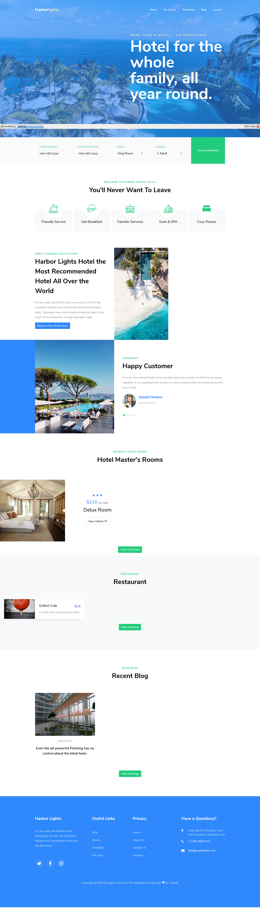
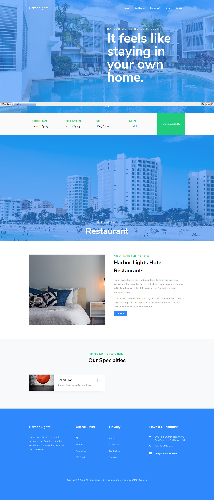
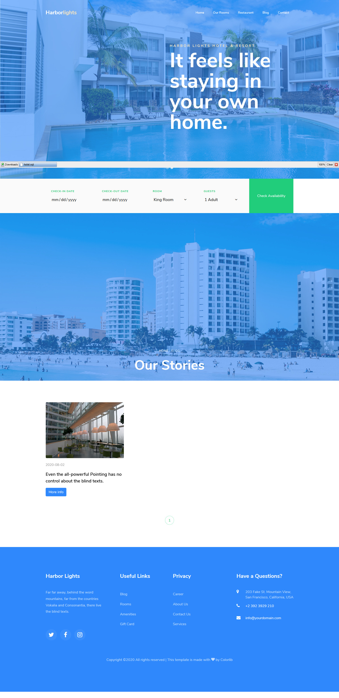
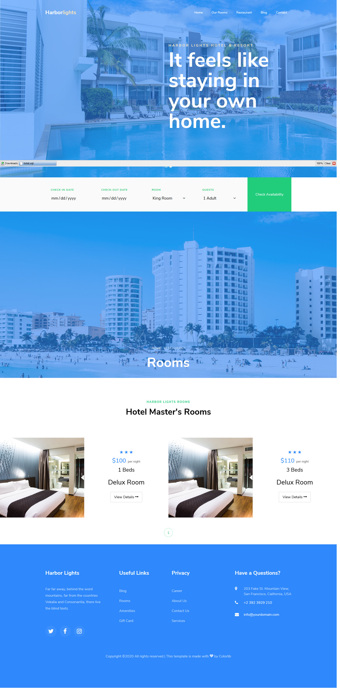
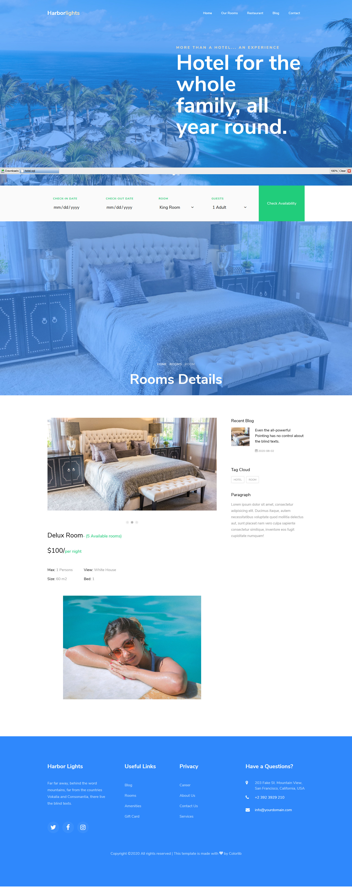
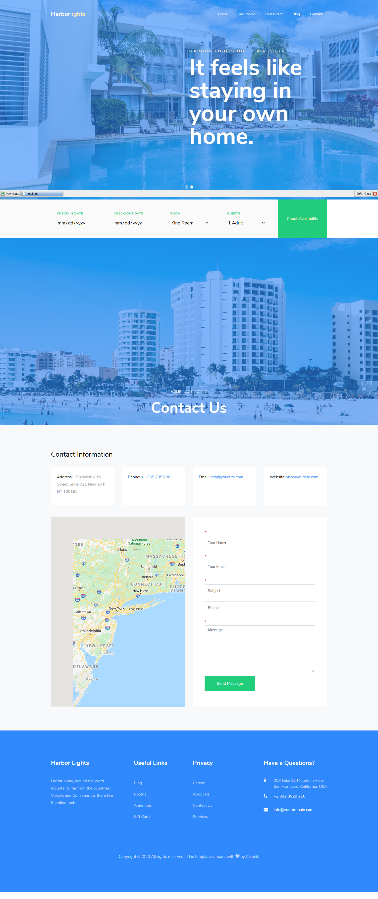
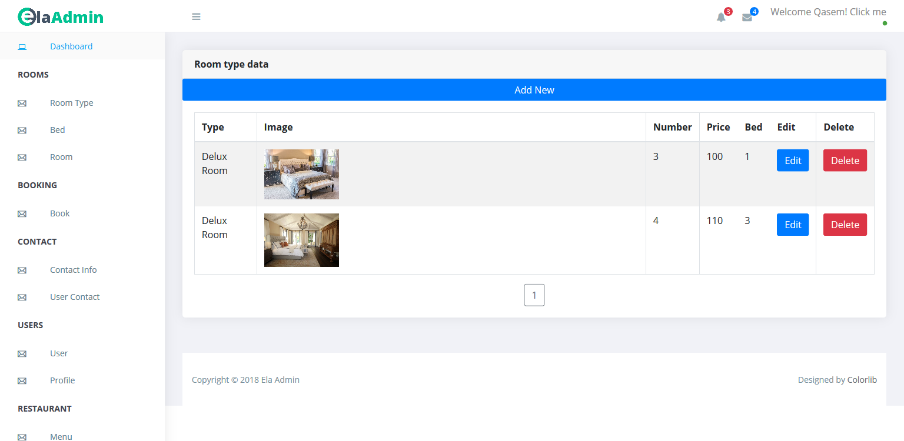
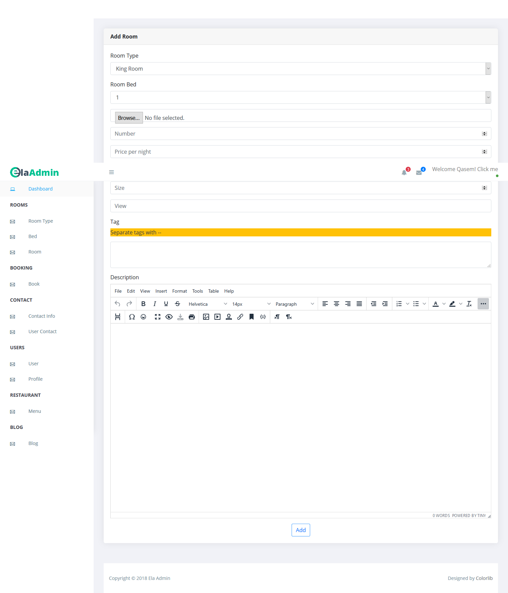
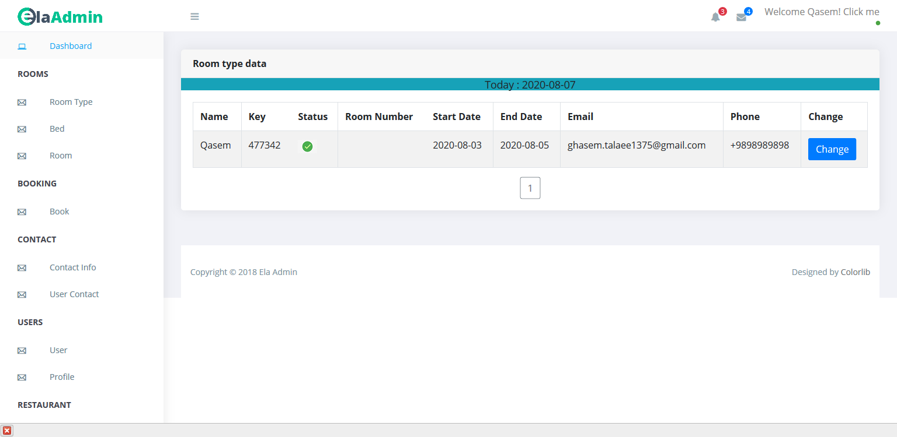

# Hotel website with PHP
Options:

- Online room reservation

-  menu of your restaurant

- Add your rooms with different types

- Add personal blog

- Contact us form

- Managment part

- Add other user in managment part

- Wysiwyg editor with easy image uploader

# Installing
1. In core/core.php file change $base_url value to folder name of your project in your localhost.

2. Set database information in core/core.php

3. Set your gmail information in core/send_email.php file.

4. Login to admin area in localhost/< folder name >/admin/ with admin@gmail.com and admin as password.

# Screenshots of Website:
### Index page

### Restaurant page

### Blog page

### Rooms page

### Rooms details page

### Contact page

# Screenshots of admin area:
### Rooms admin

### Add room admin

### Booking admin
